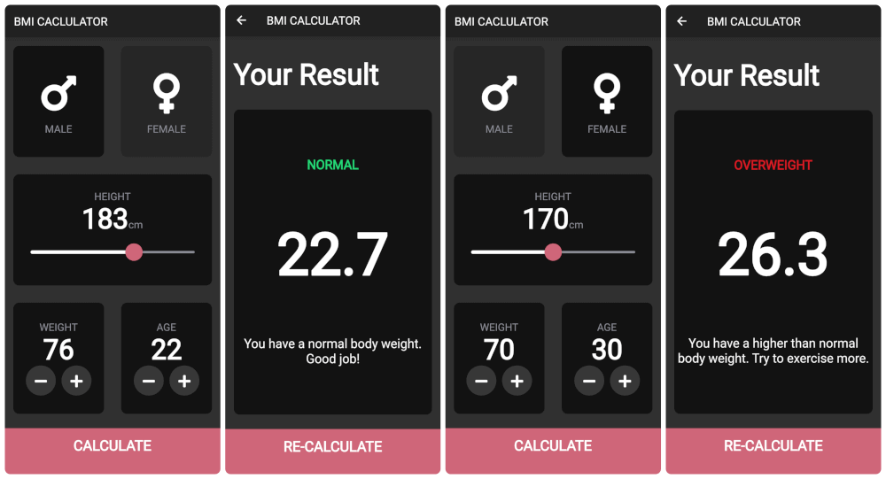

# BMI Calculator

A simple Flutter app for calculating body mass index (BMI).

<h2 align="center">
  
  <br>
</h2>

## Installation & Usage

You should have [Flutter 2 installed](https://flutter.dev/docs/get-started/install).

```bash
git clone https://github.com/armanabkar/bmi_calculator.git
cd bmi_calculator
flutter pub get
flutter run
```